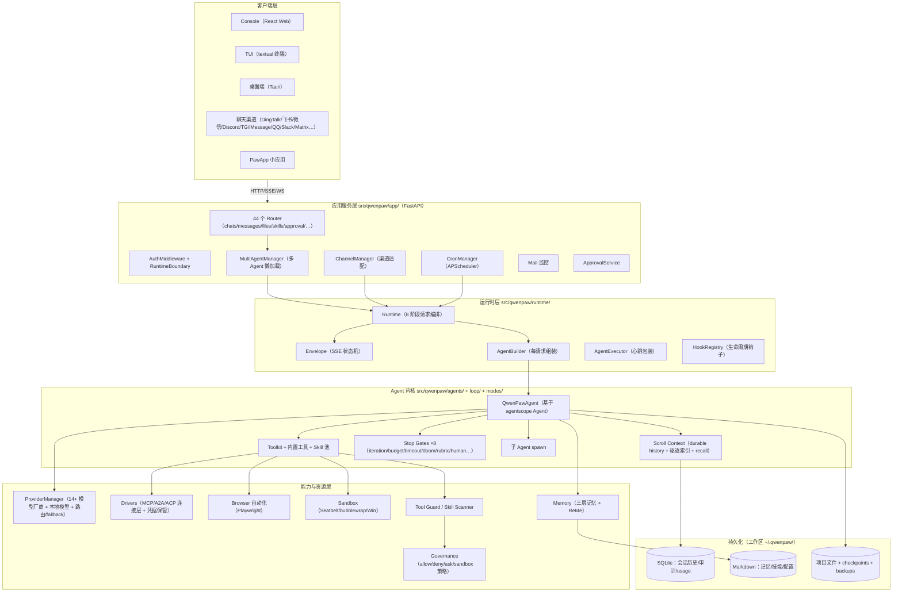
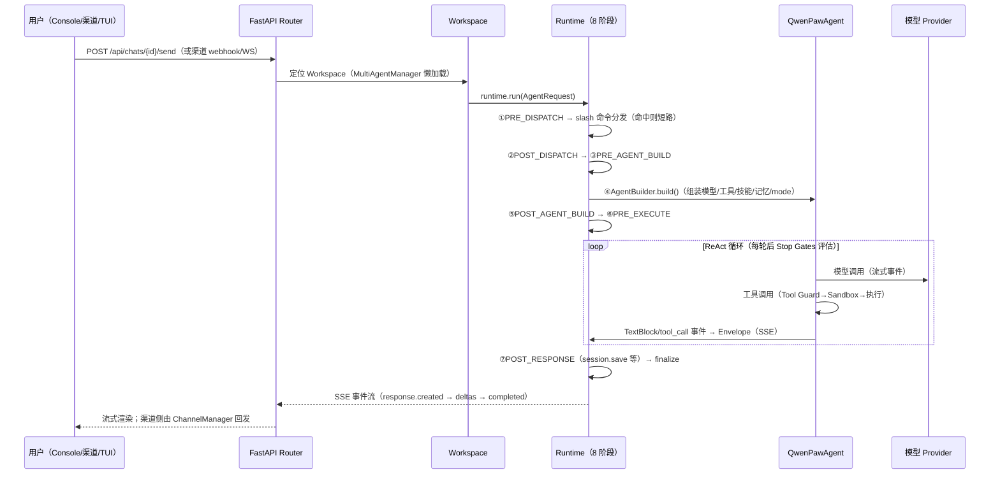
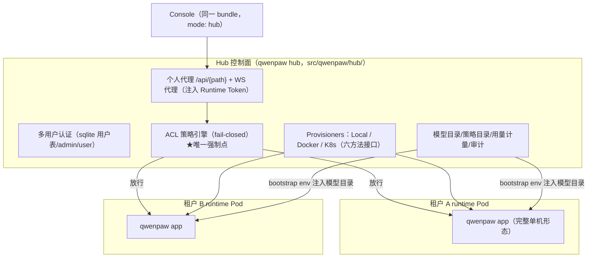

# 02 · 总体架构（Architecture）

> 本页回答三个问题：**系统分几层？一条消息怎么流过去？关键设计决策是什么？**
> 所有结论均给出代码落点，可按图索骥。

---

## 1. 分层总图



## 2. 核心抽象：Workspace = 一个完整的 Agent 运行单元

整个系统的中心抽象是 **Workspace**（`src/qwenpaw/app/workspace/workspace.py:137`）：每个 Agent（默认 Agent、QA Agent、用户自建 Agent）各有一个 Workspace，封装：

| 组件 | 职责 |
|---|---|
| `ChannelManager` | 所有渠道连接与消息进出 |
| `BaseMemoryManager` | 会话记忆 |
| `DriverManager` | 外部能力运行时（MCP 等） |
| `CronManager` | 定时任务 |
| `WorkspacePlugins` | 工具/钩子/命令/prompt 四类注册表 |

请求处理统一交给 **`Runtime`**（每个 Workspace 一个实例）。`MultiAgentManager`（`src/qwenpaw/app/multi_agent_manager.py:36`）负责多 Workspace 的**懒加载、并发启动（信号量限流）、热重载、生命周期**。

## 3. 一条消息的完整生命周期（单机形态）



**8 个 Hook 阶段**（`src/qwenpaw/runtime/phases.py:28`，固定不变；可插入点全在这）：

```
PRE_DISPATCH（请求归一化，slash 分发前）
→ [固定步：slash 命令注册表分发]
→ POST_DISPATCH（未命中 slash 后）
→ PRE_AGENT_BUILD（session.load 等预构建）
→ [固定步：AgentBuilder.build + 启动 mode]
→ POST_AGENT_BUILD（注入 mode 上下文）
→ PRE_EXECUTE（bootstrap/prompt 刷新/env 栈压入）
→ [固定步：AgentExecutor 执行 agent，产出 SSE]
→ POST_RESPONSE（session.save / cron 触发回写）
→ ON_ERROR / FINALLY（错误归一化、幂等清理）
```

> **两层钩子是正交的**：runtime hooks 包住**一次请求**的生命周期；`agentscope.middleware`（`agents/middlewares.py`）包住**单次 agent reply 循环**。插件可以同时挂两层（`src/qwenpaw/runtime/phases.py:18` 原文注明）。

## 4. 部署形态架构

### 4.1 单机（默认）

一个 `qwenpaw app` 进程 = FastAPI（uvicorn）+ 所有 Workspace + Console 静态资源（`app/_app.py` 挂载）。数据在 `~/.qwenpaw/`（working / working.secret / working.backups）。

### 4.2 Hub 多租户（企业形态）



关键决策（摘自 `docs/enterprise/01-master-plan.md` §4，均有代码背书）：

1. **权限唯一强制点在 hub 个人代理**（`hub/control_app.py` 的 `personal_runtime_proxy` + WS 代理）：runtime 保持单用户语义、对上游零侵入；console 菜单过滤只是 UX。
2. **每租户一个 runtime**（Local/Docker/K8s Pod）：与上游模型对齐，PVC 用 RWO 即可，cron/心跳天然单副本。
3. **附加层优先于侵入修改**：企业代码全部落新文件（`hub/acl/`、`hub/provisioners/k8s/`、`deploy/helm/`），改上游文件须在 09 白名单内。

## 5. 值得先记住的 6 个设计决策

| # | 决策 | 代码证据 |
|---|---|---|
| 1 | **Agent 依赖全注入**：QwenPawAgent 不自建任何依赖，构造全部委托 AgentBuilder | `agents/react_agent.py:8`（模块 docstring）、`runtime/builder.py` |
| 2 | **Scroll Context 而非摘要压缩**：每轮全量持久化，被驱逐的轮次建立索引、按需 recall——"nothing summarized away" | `agents/context/scroll/`（manager 2182 行 + memoryspace 2015 行 + eviction_index） |
| 3 | **Loop Engineering 声明式门**：循环停止条件是可编译的 gate 目录（8 种内置），三态决策 BYPASS / INTERRUPT_AND_CONTINUE / TERMINATE | `loop/gates/base.py:15`、`loop/compiler.py:11` |
| 4 | **治理先于执行**：工具调用先过 Tool Guard 规则 → 治理策略（allow/deny/ask/sandbox）→ 沙箱内执行 | `security/tool_guard/`、`governance/`、`sandbox/` |
| 5 | **协议中立驱动层**：MCP/A2A/ACP 统一为 Driver 抽象，凭据集中加密保管，每次调用过策略门 | `drivers/adapters/`、`drivers/credentials/` |
| 6 | **全插件化扩展**：工具/钩子/命令/prompt 四注册表挂在 Workspace 上，Oh-My-Paw 插件可整体打包分发 | `app/workspace/workspace_plugins.py:33`、`src/qwenpaw/plugins/` |

## 6. 模块依赖方向（谁 import 谁）

```text
console（前端） ──HTTP/SSE/WS──▶ app
渠道 SDK ──webhook──▶ app/channels
app ──▶ runtime ──▶ agents ──▶ providers / drivers / memory / context
agents/loop/modes ◀── runtime（mode 启动注入）
app/workspace ──▶ runtime + channels + crons + plugins（组装）
hub ──代理──▶ app（黑盒转发，不 import 内部）
plugins(仓库) ──插件 API──▶ agents/app 的注册表
```

> 注意 `hub` 对 `app` 是**网络转发关系**而非 import 关系——这是"企业层不侵入上游"的结构保证。

---

下一页：[03-agent-core — Agent 内核深读](03-agent-core.md)
