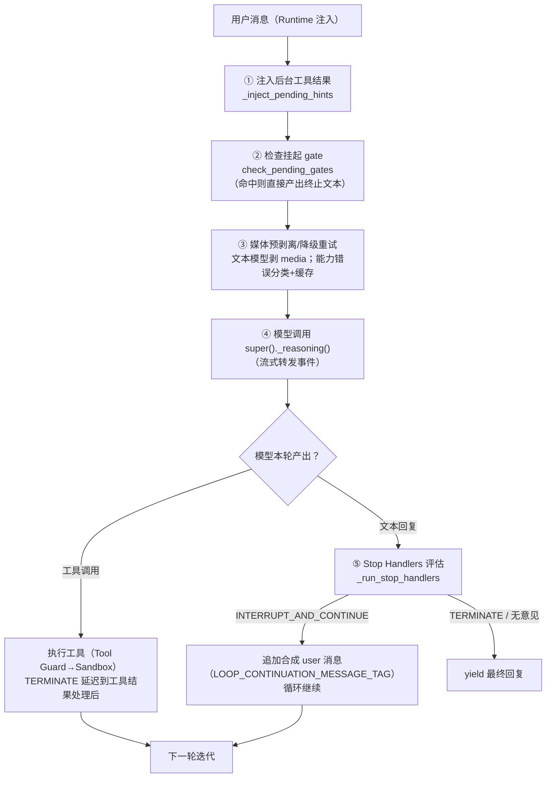

# 03 · Agent 内核（agents/ + loop/ + modes/）

> 这一页是理解 QwenPaw 的**核心**：Agent 类如何构成、一次 ReAct 循环内部发生什么、上下文如何滚动、工具如何被治理、循环如何被"门"控制、五种模式差异、外部 harness 与子代理如何接入。

---

## 1. 核心类：QwenPawAgent

```python
class QwenPawAgent(CodingModeMixin, Agent):   # agents/react_agent.py:150
```

- `Agent` 直接来自 **AgentScope 2.0**（`agentscope.agent`，与 `InjectionConfig/ReActConfig` 同源，`react_agent.py:16`）——即 ReAct 基类；pyproject 锁定 `agentscope==2.0.7.post1`。
- **构造完全依赖注入**：模型/prompt/toolkit/middlewares 都由外部 `AgentBuilder` 传入（装配在 `runtime/builder.py:477,559,565`），Agent 自身不构建任何依赖（模块 docstring 明示）。
- **刻意绕过 agentscope 内建权限引擎**：`PermissionMode.BYPASS`（`react_agent.py:222-226`），改用自家 Tool Guard（见 §4）。
- 关键覆写点：
  - `_reply`（`react_agent.py:1200`）——仅留扩展点；
  - `_reasoning`（`:833`）——**每轮 ReAct 迭代的真正主逻辑**；
  - `_execute_tool_call`（`:809`）——工具执行钩子。

## 2. 一次 ReAct 迭代的内部流程



要点（`react_agent.py:833-1067`）：

1. 工具轮的 TERMINATE 会**延迟到工具结果处理完**再生效（经 `apply_stop_result` 存入 `_gate_pending_stop`，`loop/gates/runner.py:120-141`）；
2. 文本轮（模型想停）若 gate 返回 `INTERRUPT_AND_CONTINUE`，就向 context 注入带 tag 的合成 user 消息让循环继续——**这是"让 Agent 不轻易放弃"的机制基础**；
3. stop handlers 来自 `PluginRegistry.get_stop_handlers`（`react_agent.py:1275-1292`），按 **scope 过滤**（非 default scope 激活时压制 default handler，`runner.py:54-91`）再按 **priority 排序**执行。

## 3. Loop Engineering：声明式 Stop Gates

**三态决策**（`loop/gates/base.py:17-29`）：

| StopAction | 语义 |
|---|---|
| `BYPASS` | 本 gate 无意见 |
| `INTERRUPT_AND_CONTINUE` | 打断当前模式，注入 continuation 消息，循环继续 |
| `TERMINATE` | 立即结束循环 |

**8 个内置 gate**（目录定义于 `loop/catalog.py`，实现于 `loop/gates/`）：

| Gate | 职责 | 文件 |
|---|---|---|
| `iteration_gate` | 轮数上限 | `gates/iteration.py:27` |
| `token_budget_gate` | token 预算 | `gates/limits.py:28` |
| `timeout_gate` | 时间上限 | `gates/limits.py:114` |
| `tool_call_budget_gate` | 工具调用次数预算 | `gates/limits.py:157` |
| `doom_loop_gate` | 检测重复工具调用死循环 | `gates/doom_loop.py:43` |
| `qualitative_rubric_gate` | LLM 质量评分（Default/GoalStatus/SubAgent 三策略） | `gates/rubric.py:161` |
| `completion_rubric_gate` | 完成度判定 | `gates/completion.py:25` |
| `human_gate` | **轮次到点挂起循环等人工批准（EP-2-15）** | `gates/human.py:33` |

**编译管线**：声明式配置（`CustomLoopModeConfig`）→ `compile_loop_mode()`（`loop/compiler.py:11`）先校验全部参数与互斥组、再原子地实例化为 `ConfiguredGate` 链 → 装入 `StopHandler`。gate 参数模式见 `loop/catalog.py:26-152`（如 HumanGateParams 的 `at_rounds/every_n_rounds/timeout_seconds/message`）。

**HumanGate 深读**（EP-2-15，`loop/gates/human.py`）：在配置的轮次上，通过**共享的 ApprovalService** 创建 pending approval（`source_type="loop_human_gate"`）——与工具审批同一队列、同一持久化（EP-2-12）、同一 Console 审批卡；`wait_for_approval` 阻塞等待；approve→循环继续，deny/超时（默认 600s）→TERMINATE。priority=20，排在迭代上限（10）之后。

## 4. 工具系统与 Tool Guard

- **注册**：`@tool_descriptor` 装饰器在 import 时自动收进全局 registry（`tools/__init__.py:157-168`），新工具零手工维护。内置工具含 file_io、file_search、shell、web_search、view_media、agent_management（spawn/fork 子代理）、run_tool_batch、ast_tool、LSP 系列等。
- **治理包裹**：`GuardedFunctionTool` 动态继承 agentscope `FunctionTool` 并覆写 `check_permissions`（`runtime/tool_guard.py:19-66`）——每次调用送 `qwenpaw.security.tool_guard.engine` 评估 **ALLOW / DENY / ASK**；**ASK 经 ApprovalService 发审批卡并阻塞等待**。执行级别 OFF/AUTO/SMART/STRICT 按 request_context `approval_level` > agent.json 解析；DENY 消息附"勿重试"指令（`:131-150`）。
- **执行协调**：`tool_calls/_coordinator.py:44` 的 `ToolCoordinator` 是所有在飞工具调用的唯一 owner（取消/卸载/流/超时）；每工具默认超时注册于 `_register_tool_call_hooks`（`react_agent.py:1206-1273`，如 shell 60s、chat_with_agent 300s、grep 30s）。
- **沙箱需求声明**：工具以 `ToolDescriptor.requires_sandbox` 声明，`services/workspace_manager` 的 `GuardedFunctionTool.check_permissions` 在执行前做沙箱检查。

## 5. 上下文工程：Scroll Context

`ContextManager` 是**可注入策略 Protocol**（`agents/context/base.py:19-42`：`recover_from_context_overflow / compress / on_save`）；**Scroll 是默认策略**（`strategy=="scroll"` 时 `build_scroll_components` 装配，`context/__init__.py`）。

**Scroll 的本质**（`context/scroll/`，9.3K 行）：

1. **write-through 持久化**：每条 live turn 即刻写入工作区 `history.db`（`HistoryStore`，`scroll/history.py`，SQLite）——"每轮全量持久化，nothing summarized away"。
2. **九级压力压缩管线**（`scroll/manager.py:407-437` docstring）：
   `persist → trigger 判定 → pre-fold（折叠已完成轮的工具结果）→ split（可驱逐中段 | 近期尾部+活跃轮）→ summarize（continuation summary）→ add_eviction（中段折叠为 EvictionIndex Tier 0 块，重建 context=[index]+tail）→ live-fold → think-fold → active-fold`
3. **Token 预算**：hard_limit 取 `agent.model.context_size`，预留输出 `min(4096, 5%)`，压力阈值 `pressure_threshold = max(trigger, reserve)` 逐级触发折叠（`manager.py:34-35,449-453,630`）。
4. **召回**：被驱逐内容不是丢失——驱逐索引（`eviction_index.py`）可经沙箱化 `recall_history_python` REPL 或结构化 `recall_history` 前门按需召回（`scroll/recall_tool.py`，1060 行）；免沙箱需环境变量 `QWENPAW_ALLOW_UNSANDBOXED_RECALL` 双重门禁。
5. 另有请求时图片压缩 `visual_compression/`。

## 6. 技能系统三层

| 层 | 目录 | 是什么 |
|---|---|---|
| **机制层** | `agents/skill_system/` | models/registry/store/pool_service/workspace_service——内建/池/工作区三处技能目录解析、manifest 对账、语言变体选择（-en/-zh）、env 覆盖（`registry.py:82+`） |
| **内容层** | `agents/skills/` | 随包发行的内置技能目录，每个含 `SKILL.md` + 参考 + 脚本（如 `skills/pdf-zh/SKILL.md`） |
| **工作区模板** | `agents/md_files/` | 建工作区时按语言拷入的 Markdown 模板：AGENTS/BOOTSTRAP/CONTACTS/HEARTBEAT/MAIL_TRIAGE/MEMORY/PROFILE/**SOUL**（人格行为准则）等（`agents/utils/setup_utils.py:293-323`） |

加载：`_register_skills` 把生效技能登记进 `toolkit._qp_skills`，供 `/技能名` 斜杠命令消费（`react_agent.py:462-489`）；BOOTSTRAP.md 由首交互引导钩子消费（`agents/hooks/bootstrap.py:8-19`）。

## 7. 五种 Agent 模式

基类 `AgentMode` = **命令/工具/hooks/prompt-contributor 四合一包**，唯一注册口 `setup(workspace)`（`modes/base.py:24,46-58`）；`ModeGatedHook` 自动按 `is_active` 跳过。

注册流：`bootstrap_factory.py:143-158` 列出四种内置模式 → `workspace.py:365-371` 逐个 `plugins.register_mode`；自定义模式经 `load_custom_loop_modes`。

| 模式 | 机制 | scope |
|---|---|---|
| **default** | 兜底 gate 策略：DoomLoop + Iteration + QualitativeRubric（`default/mode.py:36-63`） | default |
| **coding** | `CodingModeMixin` 混入 Agent：Coding 系统提示注入 + LSP/AST 工具（`coding/mixin.py:23-45,123`） | — |
| **goal** | `/goal` 持久循环：rubric 评分器确认完成或预算耗尽才停；默认 20 轮/300k token（`goal/goal_mode.py:40-41`）；GoalTurn/GoalBudget/Rubric 三 gate（`goal/gates.py`） | goal |
| **mission** | `/mission` 分解-实现-验证：loop 目录 + PRD + verify 命令（`mission/handler.py`） | mission |
| **custom_loop** | `DeclarativeLoopMode`：保存的 gate 流水线经 `compile_loop_mode` 编译成 ConfiguredGate 链，按会话激活（`custom_loop/mode.py:51-86`） | 自定义 |

scope 隔离规则：非 default scope 的 handler 激活时，default scope 的 handler 被跳过（`loop/gates/runner.py:54-91`）——模式专属 gate 优先。

## 8. harnesses/ 与 ACP：双向外部 Agent 接入

- **HarnessAdapter**（`harnesses/base.py`）：第三方 agent 运行时接入契约（status/login/models/history/discover_mcp）；`PROVIDER_CATALOG` 登记 **codex**（走 app-server 协议，`harnesses/codex/app_server.py`）与 **qoder**（专用 event_mapper）及能力矩阵（`harnesses/registry.py:24-60`）。
- **HarnessRuntime**（`harnesses/runtime.py:43`）：每个 workspace 拥有 adapters，把 provider 事件翻译成 QwenPaw `AgentResponse` 信封（配 HarnessSessionBridge/TextStream/ToolStream）——即 Console 里可以用 Codex/Qoder 作为"模型后端"。
- **能力投影**（`harnesses/capabilities/resolver.py`）：把 QwenPaw 管理的技能与 MCP 服务器**投影**进第三方 harness。
- **ACP = Agent Client Protocol**（`agentscope.acp`，基于官方 `agent-client-protocol` 依赖）：
  - `acp/server.py`——把 **QwenPaw 自己暴露为 ACP agent**，Zed/OpenCode 等编辑器经 stdio JSON-RPC 接入（复用完整 Workspace 生命周期）；
  - `acp/client.py`——反向接入外部 ACP agent，权限请求映射为 `SuspendedPermission`；工具 `delegate_external_agent` 供主 Agent 委派。

## 9. 子代理与用量归属（EP-2-14）

- `spawn_subagent` 工具（`tools/agent_management.py:1159-1199`）：在**当前工作区**生成一次性子代理——全新会话上下文、共享同一身份/工具/技能；`fork` 变体提供会话状态继承与 **git worktree 隔离**；`background` + `check_agent_task` 支持后台执行；`allowed_tools/skills` 可收缩子代理权限。
- **EP-2-14 principal demotion**（`app/agent_context.py:306-316`）：spawn 时铸造子 principal `"{agent_id}:sub:{session后缀}"`——**治理/审批仍路由到父身份**（权限不被降级绕过），但 **token 用量与工具审计归属子 principal**，hub 侧可拆分每个子代理的成本与活动（消费方：`token_usage/manager.py:19-30`、`hooks/request_setup/contextvars_hook.py:95`、`governance/audit.py:53`）。

## 10. 计量：token_usage 与 agent_stats

- `token_usage/model_wrapper.py` 包装 `ChatModelBase`：从每次 `ChatResponse` 记录 prompt/completion/**cache_read/cache_write** tokens 与调用数；buffer 异步聚合、按日持久化、turn_usage 写每轮元数据；**计量归属子 principal 优先**；缓存语义按 provider 适配器 MRO 白名单识别，未知模块 fail-closed（`model_wrapper.py:22-32`）。
- `agent_stats/service.py`：聚合会话文件 + token usage → `DailyStats`（会话数/消息数/llm_calls/tool_calls/缓存读）与 `AgentStatsSummary`（总量、by_date、channel_stats、缓存命中率）——支撑 Console 的 /token-usage、/agent-stats 页面。

---

相关：[02-architecture](02-architecture.md)（Runtime 8 阶段如何调用本章内容）、[08-security-governance](08-security-governance.md)（Tool Guard 细则）、[13-flows](13-flows.md)（一次带审批的工具调用走读）
