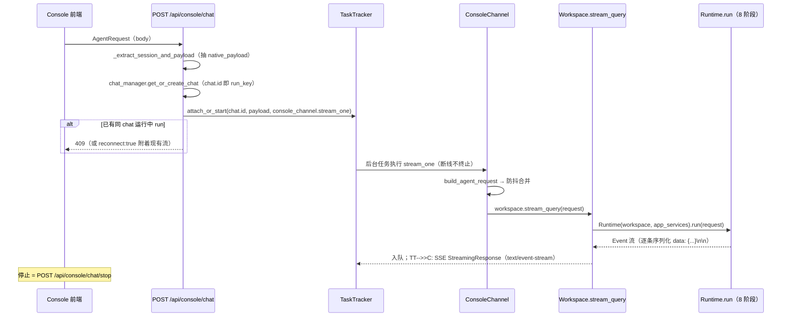

# 04 · 应用服务层（app/）

> `src/qwenpaw/app/`（92K 行）是 FastAPI 应用主体：路由、渠道、会话、审批、定时任务、邮件、MCP 客户端配置、Workspace 组装。本页按"组装 → 消息生命周期 → 各子系统"展开。

---

## 1. FastAPI 组装

- 实例创建：`src/qwenpaw/app/_app.py:749` `app = FastAPI(lifespan=...)`（/docs 开关受 `DOCS_ENABLED` 控制）。
- 进程入口：`python -m qwenpaw` → CLI → `cli/app_cmd.py:160` `uvicorn.run("qwenpaw.app._app:app")`。
- **中间件栈**（`_app.py:758-777`）：
  `AgentContextMiddleware → TraceContextMiddleware(EP-2-11) → AuthMiddleware → RuntimeBoundaryMiddleware → CORS`
- **lifespan**（`_app.py:135-746`）：快速段（<100ms）做迁移/默认 Agent、PawPort 事务恢复、Provider/AppServiceManager/WorkspaceRegistry、`@api_action` 自动注册 HTTP 路由、WorkspaceBootstrapFactory；插件/agents/审批存储放后台任务；shutdown 逆序停插件钩子→备份→browser→AppServiceManager→MultiAgentManager。
- **Router 挂载**：`_app.py:902` `include_router(api_router, prefix="/api")`，聚合 `routers/__init__.py:42-74` 的 33 个子路由（agents、config、console、fork、cron、local-models、mcp、messages、providers→/models、chats、market、skills、skills_stream(SSE)、tools、workspace、envs、token-usage、agent-stats、auth、files、settings、plugins、frontend_plugin、backups、git、project-directory、access-control、mail-access-control、provider_oauth、pawapps、harnesses、checkpoints…）；另挂 browser WS、healthz、tool-calls、approval、coding-mode、loops、agent-scoped `/api/agents/{agentId}/*`（内包 13 个子路由）、voice。
- **Console 静态服务**（`_app.py:780-812`）：目录解析顺序 env `QWENPAW_CONSOLE_STATIC_DIR` → 包内 console/ → repo `console/dist` → cwd；`/` no-cache index.html、`/assets` StaticFiles、`/console/*` 别名、catch-all SPA fallback。

## 2. 一条 chat 消息的生命周期（SSE 全链路）

关键点：**同一 chat 并发 run 会被 TaskTracker 拒绝（409）**；新 run 触发标题自动生成；断线后任务继续，重连可 attach（`routers/console.py:364-476`、`app/channels/console/channel.py:358`、`app/workspace/workspace.py:414-453`）。非 qwenpaw 后端（外部 harness）时 `stream_query` 改走 `harness_runtime.stream`。

## 3. channels/：渠道适配层

- **内置 18 渠道**（`app/channels/registry.py:19-38`）：imessage、discord、dingtalk、feishu、qq、telegram、mattermost、mqtt、console、matrix、slack、voice、sip、wecom、xiaoyi、yuanbao、wechat、onebot（console 为必需渠道）。
- **适配器接口** `BaseChannel`（`app/channels/base.py:86`）：声明 `channel` 类型与 `uses_manager_queue`；核心 `consume_one(payload)`（`base.py:1374`，含防抖/无文本缓冲）→ `_process(request)` 调 agent 并以 `send_event` 回发渠道；可选 `doctor_connectivity_notes`、`refresh_webhook_or_token`。
- **队列模型**：`ChannelManager.from_config` 建渠道，每渠道独立队列+消费循环；`unified_queue_manager.py` 的 QueueKey=(channel, session, priority)，每键独立 `asyncio.Queue` + 按需 consumer，**同键严格串行**。
- **入站 transport 各自实现**：如 DingTalk 用 `dingtalk_stream` WebSocket 长连接（`channels/dingtalk/channel.py:38-39,249`）。
- **出站统一口**：`POST /api/messages/send` → `channel_manager.send_text`（`routers/messages.py:160-166`）。

## 4. approvals/：审批子系统

`ApprovalService` 单例（`app/approvals/service.py:117`）：内存 pending 表 + `asyncio.Future`，身份策略 AGENT / EXACT_REQUESTER。

- **命令面**：`/daemon approve`、`/approve`、`/deny`、`/approval`（`channels/command_registry.py:76-88`）。
- **HTTP 面**：`/api/approval/approve|deny|list`（`routers/approval.py`）。
- **Driver 桥接**：`driver_gate.py` 把 MCP 等 Driver 的策略审批接进同一 Future 流。
- **EP-2-12（企业线）**：
  1. **持久化**——`approvals/store.py` 用 SQLite(WAL) `approvals.db` 镜像 create→resolve/cancel/timeout 事件（best-effort）；启动时 `restore_from_store` 重载 pending（kill -9 后审批仍可回答/审计）。
  2. **Hub 台账**——hub 代理缓存 approve/deny 请求体并写 `approval.resolved` 审计事件（谁、批了哪条、结果）。

## 5. crons/：定时任务

`CronManager`（`app/crons/manager.py:67`）：APScheduler `AsyncIOScheduler` + Cron/Date/Interval 触发器；heartbeat job `misfire_grace 60s` + 60s keepalive（防事件循环空闲 misfire，issue #6471）。

cron 项 `CronJobSpec`（`crons/models.py:200-213`）：id/name/enabled + schedule（cron|once、五字段、timezone、repeat_*）+ task_type（agent|text）+ DispatchSpec（投递渠道目标）+ save_result_to_inbox。JSON 仓库持久化，API `/api/cron`。

## 6. mail/：QwenPaw Mail

- `MailMonitorService`（`app/mail/monitor.py`）：**IMAP IDLE**（RFC 2177）专用线程长连接监听 agent 邮箱，失败降级 NOOP+UID SEARCH 轮询。
- 三步管道：规则（mark_read/move/notify）→ 按模式唤醒 agent（构造 request 消费 `workspace.stream_query`，同 heartbeat）→ 每封新邮件写 `new_email` inbox 事件。
- 配套：`mail_access_control.py`（per-agent 发件人白/黑名单，支持 `*@domain`）；`processing_guard.py`（mailbox consent + 批量阈值 50/连续失败 3 暂停）。
- **QwenPaw Mail 本体**是独立包 `packages/qwenpawmail-mcp`（stdio MCP server，22 个邮件工具、12 域名自动路由、本地线程索引）——见 [07-plugin-ecosystem](07-plugin-ecosystem.md)。

## 7. mcp/ 与 app_services/ 与 workspace/ 与 computer_use/

| 目录 | 职责 |
|---|---|
| `app/mcp/` | **Console 侧 MCP 客户端配置服务**：管理 MCP Driver 卡片/工具白名单/访问策略（`config_service.py`）；transport=stdio\|streamable_http\|sse（`schemas.py:31`）。QwenPaw 自己作为 MCP 客户端接外部 server；对外 MCP server 由 qwenpawmail-mcp 承担 |
| `app_services/` | 唯一跨 workspace 容器，白名单仅 task_tracker/tool_coordinator/approval_coordinator（`__init__.py:1-14`），lifespan 最先启动 |
| `workspace/` | `Workspace` = 单 Agent 完整运行时（见 [02-architecture §2](02-architecture.md)）；`service_manager.py` 声明式 ServiceDescriptor 生命周期；`service_factories.py` 组装各服务；`workspace_registry.py` 的 WorkspaceRegistry 继承 MultiAgentManager 并注入 bootstrap kwargs |
| `computer_use/` | 宿主原生 Computer Use 能力（win32/darwin Rust helper 管道，协议 v2） |

## 8. config/：配置体系

- 主配置 `WORKING_DIR/config.json`（`config/utils.py:444`；WORKING_DIR 默认 `~/.qwenpaw`）。
- 根 `Config`（`config/config.py:3116`）核心块：channels、mcp、tools、last_api、agents（仅引用 profiles）、security、acp、browser、plugins、skill_paths、user_timezone。
- **Agent 级配置** `AgentProfileConfig`（`config.py:2217`）按 agent 目录独立文件加载——每个 Agent 一个目录一套配置。
- 19 个渠道配置类、MCPConfig/SecurityConfig(tool_guard 规则) 等全 Pydantic + 原子写。
- `schemas.py`：自有流式信封 Message/Content/AgentRequest/AgentResponse/Event；`exceptions.py`：`AppBaseException(error_code, detail)` 为根。

## 9. services/workspace_manager

`src/qwenpaw/services/workspace_manager/`：per-workspace 资源管理器（working_dir + sandbox，start/stop）；工具以 `ToolDescriptor.requires_sandbox` 声明需求，`GuardedFunctionTool.check_permissions` 在 `tool.func()` 前做沙箱检查——**这是"治理先于执行"的落点之一**（见 [08-security-governance](08-security-governance.md)）。

---

相关：[02-architecture](02-architecture.md)（总图与 8 阶段）、[05-runtime-lifecycle](05-runtime-lifecycle.md)（CLI→启动链）、[13-flows](13-flows.md)（端到端走读）
