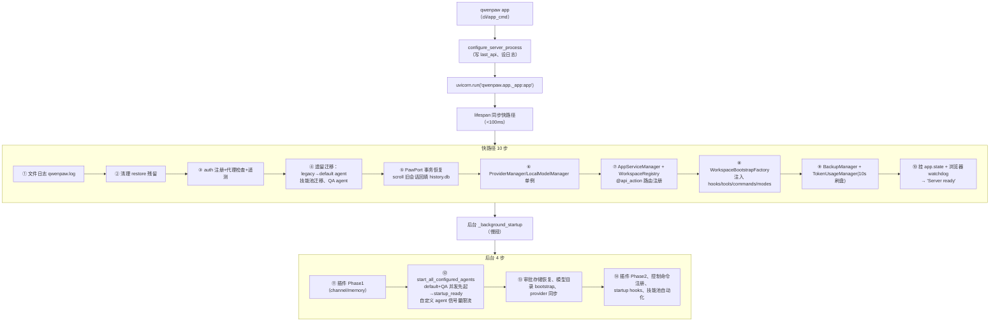

# 05 · 启动链路与运行时生命周期（cli/ + runtime/ + hooks/ + 持久化）

> 本页回答：`qwenpaw` 命令之后发生了什么？工作区长什么样？会话/检查点/备份如何持久化？

---

## 1. CLI 命令树

入口：`pyproject.toml:121-123` `qwenpaw = "qwenpaw.cli.main:cli"`（别名 `copaw`）；`python -m qwenpaw` 亦可（`__main__.py`）。`cli/main.py:131-187` 用 **LazyGroup**（懒加载子命令）注册全部命令：

| 命令 | 职责 |
|---|---|
| `app` | 跑 FastAPI 服务（uvicorn，1 worker，`cli/app_cmd.py:81-129`） |
| `tui` / 裸 `qwenpaw` | 终端聊天 UI；裸调用或首参为路径时也进 TUI（`main.py:214-221`） |
| `acp` | 以 ACP agent 身份跑 stdio 协议 |
| `hub` | 多用户 Hub 控制面（见 [10-hub-enterprise](10-hub-enterprise.md)） |
| `channels/channel` | 交互式配置渠道 |
| `daemon` | status / restart / reload-config / logs |
| `chats` | 经 HTTP API 管理会话 |
| `init` / `clean` / `uninstall` / `update` / `shutdown` / `doctor` | 初始化 / 清空工作区 / 卸载 / 自更新 / 停服 / 诊断修复 |
| `cron` `env` `models` `skills` `agents` `plugin` `task` `mission` `auth` `desktop` | 各域管理命令 |
| `auto` | 由 `@api_action` 自动生成的子命令组 |

**TUI** 是 Textual 应用（钉 `textual>=8.2.8,<8.2.9`）：`run_tui()` 构造 `AcpTransport`，用当前解释器 spawn 子进程 `python -m qwenpaw acp --local-diagnostics`，再运行 `PawApp`（`cli/tui/launch.py:131-234`）——**TUI 与 Console 是同一个 agent 的两种皮**。支持 `--agent`、`--resume <会话id>` 续聊。

## 2. 完整启动链（`qwenpaw app`）



- **懒加载**：`get_agent` 首次请求才 `Workspace()` + `bootstrap_plugins()` + `start()`（`multi_agent_manager.py:168-275`）。
- **Workspace.start** 按 ServiceManager 优先级起服务：local_workspace(5) → session(10) → memory/driver/chat(20 并发) → channel(30) → cron(40) → mail(45) → watcher(50/51)（`workspace.py:688-749`）。

## 3. 工作区目录布局

```text
~/.qwenpaw/                      # WORKING_DIR（env QWENPAW_WORKING_DIR > legacy ~/.copaw > 默认）
├── config.json                  # 主配置
├── workspaces/<agent_id>/       # 每个 Agent 一个目录
│   ├── agent.json               # Agent 级配置（AgentProfileConfig）
│   ├── sessions/[channel/]      # 会话 JSON（原子写）
│   ├── memory/  skills/  drivers/
│   ├── checkpoints/shadow.git   # 影子 git 检查点（裸仓库）
│   ├── jobs.json  chats.json
├── approvals.db                 # 审批持久化（EP-2-12，WAL）
├── token_usage.json             # token 用量
├── memory/  qwenpaw.log
~/.qwenpaw.secret/               # SECRET_DIR（envs.json 等，加密）
~/.qwenpaw.backups/              # 备份 zip（保留 20 条）
```

## 4. hooks/：请求级钩子（与 agent 级正交）

`qwenpaw/hooks/` 的 7 组钩子全部由 `WorkspaceBootstrapFactory` 收集，注册进每个工作区的 HookRegistry，按 **(priority, 注册序)** 在 8 阶段（见 [02-architecture](02-architecture.md)）执行：

| 子目录 | 钩子 | 阶段 |
|---|---|---|
| bootstrap/ | `BootstrapHook`（首启引导） | PRE_EXECUTE |
| cron/ | CronContextHook / CronMemoryIsolateHook / CronMemoryRestoreHook（cron 请求上下文隔离+记忆还原） | PRE_DISPATCH / PRE_EXECUTE / POST_RESPONSE |
| error/ | ErrorNormalizeHook / CancelCleanupHook | ON_ERROR |
| observability/ | LangfuseTraceHook / CleanupHook（可选） | PRE_EXECUTE / FINALLY |
| request_setup/ | ContextVarsSetupHook（项目目录解析）/ AgentContextVarsSetupHook / MediaProcessHook / MailF1CleanupHook | PRE_DISPATCH / POST_AGENT_BUILD / PRE_EXECUTE / FINALLY |
| session/ | SessionLoadHook / SessionSaveHook（会话状态装卸） | PRE_AGENT_BUILD / POST_RESPONSE |
| skill_env/ | SkillEnvHook / CleanupHook（技能环境变量栈） | PRE_EXECUTE / FINALLY |

另有 checkpoints 的 QueryGate(PRE_DISPATCH) / AutoSnapshot(POST_RESPONSE)。

> **两层钩子正交**（`runtime/phases.py:18-20` 原文）：`qwenpaw/hooks` 包**一次请求**；`agents/hooks/` 是挂在 QwenPawAgent 上的 AgentScope 回调（如首次交互 BOOTSTRAP.md 引导）。

## 5. 持久化三层

### 5.1 会话层（JSON + SQLite 双轨）

- 会话元数据/近期状态：**JSON 文件**原子写 `sessions/[channel/]{uid}_{sid}.json`（`app/chats/session.py:220-301`），由 SessionLoad/SaveHook 装卸。
- 长对话历史：scroll 后端把完整轮次写入 **history.db**（SQLite，`agents/context/scroll/manager.py:109`）+ 驱逐索引 + 延续摘要；启动时把旧 sessions/*.json 一次性回填（`scroll/sync.py:774-786`）。
- **打断保护**：`/stop` 时 `_try_save_on_cancel` 注入半截流式文本、闭合悬空 tool call 后 shield 保存（`runtime/runtime.py:162-168,237+`）——中断轮次不丢失。

### 5.2 检查点层（影子 git）

- `CheckpointRepository` 在 `checkpoints/shadow.git` 建裸仓库，gitattributes 强制字节保真，`GitBlobBatch` 批量流式写入（`checkpoints/repository.py:33-45`、`git_batch.py:71`）。
- 快照三种 kind：auto / snap / pre-restore（`service.py:254-341`）；回复完成后自动打点。
- **恢复是事务**：先打 pre-restore 快照，失败回滚（`restore.py:206-257,384-432`）。

### 5.3 备份层（签名 zip）

`BackupManager`：单活跃 job、进度订阅、保留 20 条；把 config.json、各 workspace、secrets、skill_pool 压成**带签名**的 zip（签名密钥存 `BACKUP_DIR/.signing_key`，不随包分发）（`backup/manager.py:53-98`、`_utils/constants.py:18-21`）。

## 6. envs/：环境变量管理

两层持久化：`SECRET_DIR/envs.json`（加密、重启存活）+ 注入 `os.environ`（供 `os.getenv` 与子进程）。设计定论（`docs/design/environment-management-redesign.md`）：**os.environ 是唯一运行时状态**，`EnvVarLoader` 做无缓存类型化读取；`EnvVarSpec` 目录区分 `hot_runtime`/`startup_only` 可变性；Provider 凭据仍归 ProviderManager 管。`_app.py:78-80` 在 import 期即执行 `load_envs_into_environ()`。

## 7. observability 与计量落盘

- **Langfuse**（可选）：装 langfuse 且设 `LANGFUSE_SECRET_KEY` 才启用；OpenAI instrumentation + ContextVar trace（`observability/langfuse.py:34-52`）。
- **token 计量**：`TokenUsageManager` 单例；`TokenRecordingModelWrapper` 热路径 enqueue，buffer 异步每 10s 刷盘到 `token_usage.json`（格式：`TokenUsageSummary{total_prompt/completion/cache_read/cache_write, total_calls, by_model, by_date}`）（`token_usage/manager.py:82-110`）。
- **日志**：全量落 `WORKING_DIR/qwenpaw.log`。
- **启动性能**：`scripts/startup_profile/analyze.py` 用 `-X importtime` 采集导入耗时 + 函数级 trace，产出 JSON 供 viewer.html。

---

相关：[02-architecture](02-architecture.md)（8 阶段详解）、[03-agent-core](03-agent-core.md)（AgentBuilder 组装）、[04-app-server](04-app-server.md)（lifespan 与服务）
