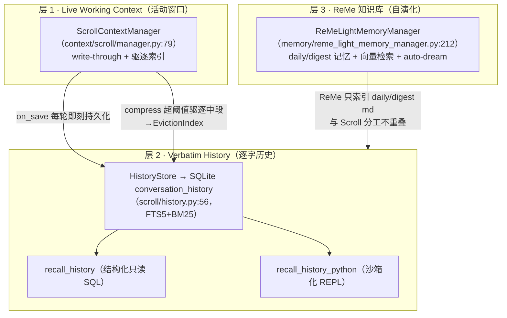
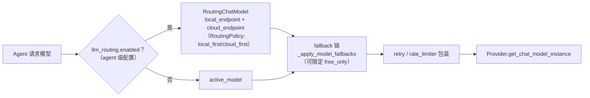

# 06 · 记忆系统与模型接入（memory/ + providers/ + local_models/ + 模型路由）

> "Never forgets" 的产品承诺落在哪里？本页拆开三层记忆的真实实现、35 个模型厂商的抽象、本地推理与统一模型路由。

---

## 1. 三层记忆的真实结构

`src/qwenpaw/memory/` 只是一个 30 行的**门面**——把插件 API 所需契约（`BaseMemoryManager`、`MemoryBackendRegistry` 等）从 `agents.memory` 重新导出（`memory/__init__.py:8-18`），真正实现全在 `src/qwenpaw/agents/`。

### 层 1 · 活动窗口
`ScrollContextManager`（见 [03-agent-core §5](03-agent-core.md) 九级压缩管线）以策略注入方式挂进 QwenPawAgent；被驱逐轮次折叠为 in-context `EvictionIndex`，续写摘要只是状态缓存、**绝不替代原始历史**。

### 层 2 · 逐字历史 + 两个召回工具
- `HistoryStore` 拥有 SQLite `conversation_history` 读写连接，含 **FTS5 全文索引 + BM25**（`scroll/history.py:217`）；行带 session_id/agent_id 支持跨会话按 Agent 召回。
- 模型经两个工具回读：
  - `recall_history`（`scroll/recall_tool.py`）——结构化参数（expand/search/recall_tool/days_between），参数化只读 SQL，无需沙箱；
  - `recall_history_python`（`scroll/memoryspace.py` + `repl.py`）——**沙箱化 REPL 逃生舱**：`main` 内存库 + 只读 ATTACH 的 `hist` schema，模型可自写 SQL。
- recall 自身的 turn 被排除出搜索索引，防自污染（`memoryspace.py:34-43`）。

### 层 3 · ReMe 知识库
- `ReMeLightMemoryManager`（`@memory_registry.register("remelight")`，`memory/reme_light_memory_manager.py:214`）以 QwenPaw workspace 为 vault；daily/digest 记忆、搜索、auto-memory、auto-dream 全部经 ReMe job 执行。
- 集成方式是**钉死版本的嵌入 app**：`_REQUIRED_REME_VERSION = "0.4.1.11"`（启动时校验版本与关键契约，`reme_light_memory_manager.py:103,152-184`）；依赖 `reme-ai==0.4.1.11` + `reme-auto-fin` + `reme-daily-paper`（pyproject）。
- 刻意分工：ReMe 索引只 watch `daily_dir/digest_dir` 的 markdown，**原始对话检索归 Scroll**——"两套系统不重复建索引"（`reme_config.py:57-63`）。
- `memory_search` 跑 ReMe `search` job（向量 + BM25 **RRF 融合**），可选 reranker 超采重排。

### 注册与生命周期
`MemoryBackendRegistry`（owner-aware，防插件卸载竞态）+ 全局 `memory_registry`；未知 backend 显式抛错、**绝不静默换后端**（`base_memory_manager.py:1037,1170`）。基类生命周期 `start/close/memory_search/build_middlewares/list_cron_jobs`，自带 auto-memory 异步 worker 队列。外置记忆后端（ADBPG/PowerContext）已插件化到 `plugins/memory/`（企业线 Phase 3 扩展点）。

## 2. providers/：35 个内置厂商的抽象

- **基类** `Provider(ProviderInfo, ABC)`（`providers/provider.py:521`）四个抽象方法：`check_connection / fetch_models / check_model_connection / get_chat_model_instance`。`ProviderInfo` 是 pydantic 配置模型（base_url/api_key/chat_model/models/discovery_strategy 等）。
- **13 个 Provider 类**：绝大多数厂商继承 `OpenAIProvider`（OpenAI 兼容协议一网打尽）；例外是 Anthropic、Gemini、OpenRouter 等自有协议类。
- **`BUILTIN_PROVIDERS` 共 35 个**（`provider_catalog.py:520-556`）：qwenpaw-local、ollama、lmstudio、openrouter、github-models、modelscope、dashscope、阿里云 codingplan/tokenplan、openai、azure-openai、anthropic、gemini、deepseek、kimi×3、minimax×2、智谱×4、siliconflow×2、火山×3、MiMo×2…
- 运行时由 `ProviderManager` 装入；插件厂商走 `PluginProviderRegistry` + `PluginApi.register_provider`。
- `oauth/`：`OAuthFlow` ABC（start/exchange/refresh），现实现 OpenRouter PKCE + session store。
- `data/`：维护的 `model_catalog.json`（21 组清单，含多模态/免费/推荐标注）与 `model_capabilities.json`；发现流程把 API 发现与目录按策略合并。外围包装器：retry / fallback / rate_limiter / multimodal_prober。

## 3. local_models/：llama.cpp 一条路（无 mlx/onnx）

- `LlamaCppBackend`（`local_models/llamacpp.py:52`）负责 **llama-server** 可执行文件下载安装（版本 b8744，官方镜像 download.qwenpaw.agentscope.io）、子进程拉起、`/health` 就绪探测、`.gguf` 校验。
- `LocalModelManager` 单例门面（max_context_length 默认 65536）；`ModelManager` 用 spawn 子进程下载模型，源自动选 ModelScope/HuggingFace。
- **QwenPaw-Flash 加载**（`model_manager.py:78-129`）：按内存推荐 6 个 GGUF 之一——`AgentScope/QwenPaw-Flash-{2B,4B,9B}-{Q4_K_M,Q8_0}`（≤8GB→2B，≤16GB→4B，更大→9B）。
- 与 provider 体系接缝：`id="qwenpaw-local"`（is_local、免 key、OpenAI 兼容）；启动时 `_resume_local_model` 恢复服务并回写 `base_url=http://127.0.0.1:{port}/v1`（`provider_manager.py:878-930`）。

## 4. 统一模型路由（三层机制）

1. **双槽路由**：`RoutingChatModel`（`agents/routing_chat_model.py:64`）按 `mode` 在本地/云端点间决策；配置为 **agent 级字段** `llm_routing`（`config/config.py:2281`），Console 经 REST 读写（`app/routers/config.py:765-782`）。
2. **per-agent 主模型 + 降级链**：`agents/model_factory.py:2031-2093` 读 agent 的 `active_model/fallback_models/fallback_policy/retry/rate_limit/thinking_level`，组装 `FallbackChatModel` 再叠 retry/rate_limiter；统一入口 `create_model_and_formatter`。
3. **本地恢复**：启动时恢复 qwenpaw-local llama-server。

---

相关：[03-agent-core](03-agent-core.md)（Scroll 压缩管线）、[07-plugin-ecosystem](07-plugin-ecosystem.md)（插件可注册 provider 与 memory backend）
