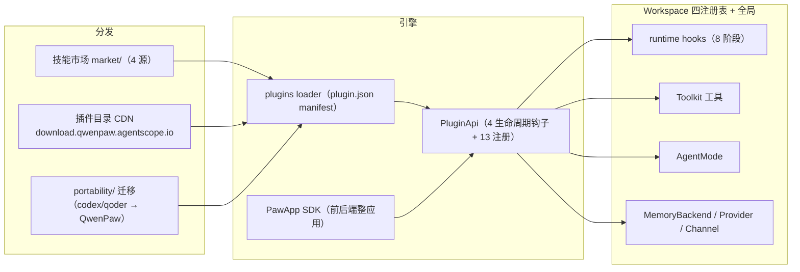

# 07 · 插件与扩展生态（plugins/ + market/ + portability/ + PawApp + qwenpawmail-mcp）

> QwenPaw 的"Extensible"承诺由四套机制构成：Oh-My-Paw 插件系统（引擎）、官方插件集（内容）、技能市场（分发）、迁移工具（获客）。本页逐一拆解。

---

## 1. 插件系统引擎（src/qwenpaw/plugins/）

"Oh-My-Paw" 是官方插件集的品牌名；**引擎**在 `src/qwenpaw/plugins/`：

- **PluginApi**（`plugins/api.py:314`）是插件获得的全部能力面：
  - **4 类生命周期钩子**：`register_startup_hook` / `register_shutdown_hook` / `register_uninstall_hook` / `register_workspace_created_hook`；
  - **13 种能力注册**：`register_tool`、`register_slash_command`、`register_mode`、`register_runtime_hook`、`register_agent_stop_handler`、`register_prompt_section`、`register_skill_provider`、`register_memory_backend`、`register_provider`、`register_http_router`、`register_control_command`、`register_middleware`、`register_channel`。
  - 工具注册自动同步治理白名单（`api.py:108-130`）——插件工具也进 Tool Guard 管辖。
- **运行期钩子点** = runtime 8 阶段（见 [02-architecture](02-architecture.md)）；返回语义 CONTINUE / SHORT_CIRCUIT / SKIP_AGENT；与 agentscope middleware 正交。
- **manifest 与发现**：`plugin.json` 声明 `PluginType`（tool/provider/hook/command/channel/memory/frontend/app/general）+ frontend/backend 入口 + `qwenpaw_version` 兼容区间（`architecture.py:12-122`）。`loader.py` 扫描 plugin_dirs 下含 plugin.json 的目录，动态导入 backend 入口并构造 PluginApi；纯 frontend 插件也可加载。
- **安装**：`POST /plugins/install`（URL zip 或本地路径，装载即生效）；官方目录由 CDN `download.qwenpaw.agentscope.io` 的 catalog 提供（版本兼容过滤）。

## 2. 官方插件集形态（仓库 plugins/）

| 插件 | 类型 | 形态说明 |
|---|---|---|
| **cloudpaw** | general | backend plugin.py + frontend ui/dist：阿里云 ROS/Terraform 部署编排 + A2A 多智能体（tools/a2a_*.py、routers/） |
| **computer-use** | tool | 注册桌面自动化工具（protocol/dispatch/client/transport 走原生 runtime），附 skills/ |
| **qwenpaw-pet** | tool | `emitter.py` 把后端生命周期事件推给桌面宠物（127.0.0.1:8765） |
| **omp_workflows** | bundle | 一次 `register_mode` 五个 AgentMode：Autopilot / Ralph / Team / UltraQA / Ultrawork + skill_provider——**自定义循环模式的最佳范例** |
| **memory/adbpg、powercontext** | memory | `register_memory_backend` 注册 AnalyticDB PostgreSQL 向量记忆等外置后端 |
| **channel/azure_bot** | channel | `register_channel` 扩渠道 |
| **middleware-demo** | hook | thinking-log / tracing 中间件示例 |
| **apps/agent-kanban、qwenpaw-creator、qwenpaw-data** | app | PawApp 整应用（backend+ui） |

## 3. PawApp SDK（src/qwenpaw/pawapp/）

**带前端+后端入口的插件平台**（比普通插件重一级）：

- `PawApp` 包装 PluginApi；`get_ctx` 作为 FastAPI 依赖注入 `PawAppContext`（ctx.chat / storage / tools / ui）。
- `ManagedAgentProfile`：幂等创建/卸载 detach 不删会话；`ManagedService`；`DependencyRegistry` 健康探针（`pawapp/__init__.py:1-15`、`agent.py`）。
- Console 侧 `/apps/:appId` 路由渲染。qwenpaw-creator（蓝图工作台）、qwenpaw-data（问数）都是 PawApp。

## 4. market/：技能市场（4 源）

注意：`market/` 是 **skill market**（搜索/安装技能），插件市场另走 plugins download_catalog CDN。

`MarketProvider` Protocol（key/label/supports_browse/available/search，15s 预算）注册 **4 个市场源**（`market/providers/__init__.py:17-22`）：

| 源 | 上游 |
|---|---|
| qwenpaw | platform.agentscope.io `/openapi/v1/skills` |
| clawhub | clawhub.ai `/api/v1/search` + `/trending` |
| modelscope | modelscope.cn openapi |
| aliyun | AgentExplorer（ACS3-HMAC-SHA256 签名） |

`search_market`（`market/service.py:38`）聚合各源结果。

## 5. portability/：从 Codex 与 Qoder 迁入

- **只支持两个源**：`provider_names() = ("codex", "qoder")`（`portability/providers/__init__.py:14-16`）；`.claude-plugin/plugin.json` 仅作为 Codex 内容包的兼容 manifest 读取——**没有 chatgpt/claude 平台级导入**。
- 迁移覆盖：会话 JSONL 转录（Qoder 读 SQLite UI 索引）、memory/skills/MCP/plugins/定时任务（只读不执行）。
- **插件迁移是受限翻译**：Codex 内容包 `codex_content_bundle_v1`；Qoder `qwen_skill_only_v1`（只适配 Skill-only，原生 tools/hooks/MCP 拒绝自动适配），生成 QwenPaw 包装插件。
- **golden fixtures**（`tests/fixtures/portability/`）：迷你源 home + `golden/*-mini-inventory.json` 清点基线；契约测试断言迁移 inventory 与 golden 逐字段一致——重构护栏。

## 6. packages/qwenpawmail-mcp：独立邮件 MCP 服务器

monorepo 内独立 hatchling 包（依赖仅 `mcp>=1.28` + `imap-tools`，未发 PyPI）：

- stdio 传输的 FastMCP 服务器，注册 **23 个工具**（读/写/破坏性均注解）；
- `providers.py` 按邮箱域自动路由 **12 家** IMAP/SMTP（163/126/QQ/Gmail/阿里云等）；
- `thread_store.py` 本地会话线程索引 + 全文搜索；无状态连接模型（每次操作新开连接）；
- QwenPaw 主进程以 `sys.executable -m qwenpawmail_mcp` 拉起注入环境变量；也可被 Claude Desktop 等任意 MCP 客户端独立使用。

## 7. 生态全景图

---

相关：[03-agent-core](03-agent-core.md)（mode 与 stop handler）、[04-app-server](04-app-server.md)（安装 API）、[12-testing-workflow](12-testing-workflow.md)（plugins-release CI）
