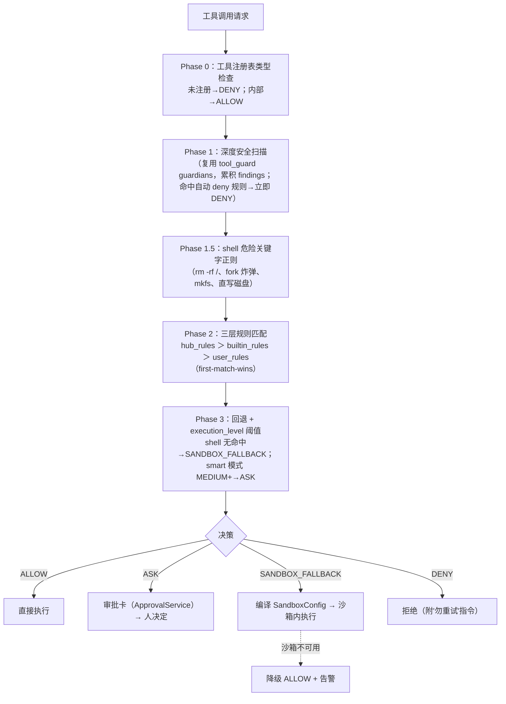

# 08 · 安全、治理与沙箱（governance/ + security/ + sandbox/ + drivers/）

> QwenPaw 把"危险命令在执行前被拦截"作为产品承诺。本页讲清四层防线如何协作：治理策略 → Tool Guard → OS 级沙箱 → Driver 连接层门禁。

---

## 1. 治理体系总览

**策略模型**（`governance/policy.py`）：

- `GovernanceAction` 四值：`ALLOW / DENY / ASK / SANDBOX_FALLBACK`（`policy.py:39-44`）。
- 规则用 `match="ToolName(pattern)"` 统一表达，如 `Bash(git *)`、`Write(.env*)`、`*(.ssh/**)`（`*` 匹配所有工具），带 grantee / duration(session|permanent) 维度（`policy.py:92-124`）。
- **三层规则**：`hub_rules`（组织基线，EP-2-13 下发）＞ `builtin_rules`（仅存代码，YAML 中出现即被忽略）＞ `user_rules`（用户批准生成）——first-match-wins（`policy.py:660,786-875`）。
- `ResourceGovernor.assert_policy`（`resource_governor.py:224-301`）负责评估 + 沙箱降级 + 编译 SandboxConfig；`PolicyGuardedTool`（`tool_adapter.py`）包装工具做前置决策与沙箱违规重试循环。审计落 SQLite `audit_events`（`audit.py:34`）；**策略目录存工作区外防篡改**（`resource_governor.py:93-107`）。

## 2. Tool Guard（security/tool_guard/）

- `ToolGuardEngine` 编排三类 guardian（engine.py:29-44）。
- **真实规则举例**（`rules/dangerous_shell_commands.yaml`，21 条）：`TOOL_CMD_DANGEROUS_RM`（`\brm\b`，HIGH）、`TOOL_CMD_FIND_DELETE`、`TOOL_CMD_DOS_FORK_BOMB`、`TOOL_CMD_REVERSE_SHELL`、`TOOL_CMD_PRIVILEGE_ESCALATION`（sudo）、`TOOL_CMD_IFS_INJECTION`。
- `ShellEvasionGuardian` 含 **7 项绕过检测**：command_substitution、混淆 flag、反斜杠转义空白/操作符、newlines、comment_quote_desync、quoted_newline（`shell_evasion_guardian.py:505-512`）——防止用 `ca\tt`、`$(...)`、注释错位等手法绕过。
- `FilePathToolGuardian` 扫敏感路径。

## 3. Skill Scanner（security/skill_scanner/）

技能**安装/导入时**扫描目录（`skill_system/store.py` 的 `scan_skill_dir_or_raise`）。8 组签名包：command_injection、data_exfiltration、hardcoded_secrets、obfuscation、prompt_injection、social_engineering、supply_chain、unauthorized_tool_use（`rules/signatures/`）。如 `COMMAND_INJECTION_EVAL`、`DATA_EXFIL_BASE64_AND_NETWORK`（base64+网络同时出现=数据外传暂存）。`ScanPolicy` 支持 YAML 组织级白名单定制。

## 4. 沙箱三平台（sandbox/，9.7K 行）

统一入口 `SandboxConfig`（**allowlist 模型**，`config.py:104-164`），工厂 `create_sandbox` 分发；核心纪律：**无法实施的约束必须 `report_unenforced_config` 告警，绝不静默丢弃**（`config.py:323-363`）。

| 平台 | 机制 | 关键实现 |
|---|---|---|
| **macOS** | **Seatbelt**：配置编译成 `.sb` profile，`sandbox-exec -p '<profile>' shell -c cmd` 内核执行 | `(deny default)` 起步；allow_read_all 时先放行读再对 deny_paths 逐条 deny；`DEFAULT_SANDBOX_DENY_PATHS` 含 `~/.env`、`~/.ssh`、`~/.aws`、`~/Library/Keychains`、Chrome Login Data 等 20+ 敏感路径（`policy.py:332-374`）；违规用精确正则匹配 `deny(1)` 诊断（`macos_sandbox.py`） |
| **Linux** | 优先 **bubblewrap**：`--ro-bind / /` 或 tmpfs 空根、deny_paths 用 `--tmpfs` 遮蔽目录/`--ro-bind /dev/null` 覆盖文件、`--unshare-user --uid 0 --unshare-pid`、硬编码 /bin/sh 防注入 | 回退 **Landlock** LSM：ctypes 直发 syscall 444/445/446，按 access bit 逐路径加规则（`linux_sandbox.py:54-101`） |
| **Windows** | 三后端：**AppContainer**（SID S-1-15-2 隔离，仅显式 ACE 可访问）/ **Elevated**（专用账户 + WRITE_RESTRICTED token + WFP 防火墙断网）/ **Unelevated**（WRITE_RESTRICTED token） | 按 allow_read_all+是否管理员分派（`config.py:746-761`） |

已知边界（如实登记于代码注释）：网络默认 `network_allow=["*"]` 全放行——Landlock 网络需 ABI v4、Seatbelt 无域名级过滤，域名过滤各后端均不可实现、fail-open（`resource_governor.py:403-412`、`config.py:239-242`）。

## 5. drivers/：协议中立连接层

- 抽象：`DriverCard`（协议卡片）+ `DriverPolicy`（**default_effect=deny**，`policy_types.py:117-121`）+ `DriverManager`（注册/重连/瞬态驱动）。
- 规则含 principal（source_type/subject_type 结构化选择器）与 TimeRange 条件；评估按 specificity 排序、**DENY＞ASK＞ALLOW 严格度优先**（`drivers/policy.py:47-53`）。
- **per-call gate**：`DriverHandler._authorize_invocation`（`handler.py:174-207`）——每次能力调用构建 `DriverInvocationContext` → `evaluate_policy` → DENY 抛 `DriverPermissionDeniedError`；ASK 或 strict 档走 approval gate。
- 协议实现：**MCP 是唯一已实现 handler**（`handlers/mcp.py`：StdIO/HTTP 有状态客户端 + streamable-http 自动协商 + 工具白名单）；**ACP** 在 `agents/acp/`；**A2A** 仅未来占位（`capabilities.py:11`）。
- **凭据保管**：`AsyncCredentialStore` per-workspace YAML，值经 `security/secret_store.py` **Fernet（AES-128-CBC+HMAC）加密**、`ENC:` 前缀透明迁移，**主钥优先 OS keyring**（`secret_store.py:1-12`）。

## 6. 执行级别与审批的联动

- 级别 OFF / AUTO / SMART / STRICT（`runtime/tool_guard.py:103-129` 解析优先级：request_context `approval_level` > agent.json）。
- STRICT 特例：即使 hub 规则 ALLOW 也升为 ASK（`governance/policy.py:797-803`，EP-2-13）。
- ASK 的落点就是 [04-app-server §4](04-app-server.md) 的 ApprovalService——审批卡在 Console/渠道命令/http API 三处可回答。

## 7. 企业线在此域的增量（详见 [10-hub-enterprise](10-hub-enterprise.md)）

| EP | 增量 |
|---|---|
| EP-2-12 | 审批 SQLite 持久化（kill -9 后仍可回答）+ hub 审计台账 |
| EP-2-13 | 组织策略基线 hub 下发（sha256 校验、fail-closed、hub_rules 高于本地且永不落 YAML） |
| EP-2-14 | 子 Agent principal 降权：治理走父身份，用量/审计归子 principal |
| EP-2-11 | trace_id 贯穿 hub 审计→请求→runtime 审计 |

---

相关：[03-agent-core §4](03-agent-core.md)（GuardedFunctionTool 如何包裹工具）、[10-hub-enterprise](10-hub-enterprise.md)（组织级治理）
