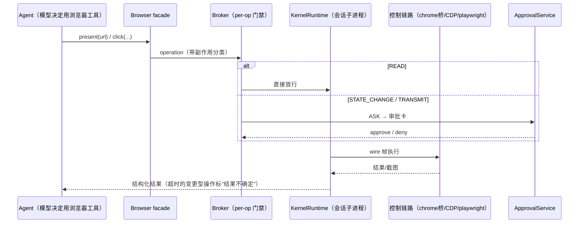

# 09 · 浏览器与桌面自动化（browser/ + computer_use/ + tunnel/ + tauri/）

> Agent 的"手"：浏览器三控制链路、副作用门禁、桌面原生控制、内网穿透与桌面壳。

---

## 1. browser/ 子系统（11K 行）

### 1.1 三种控制链路（control_link/）

`control_link/` 是**控制链路抽象**——同一 SDK 可切换后端，三个变体自注册（`control_link/__init__.py:11-19`）：

1. **chrome 直控桥**（打包的 chrome 扩展，`plugins/bundle/chrome/`，与 `_app.py` 的 browser chrome WS 路由配合）；
2. **CDP**（Chrome DevTools Protocol 直连）；
3. **playwright 适配器**。

### 1.2 执行模型（execution/）

- `KernelRuntime` 按 `workspace/session` 键把执行路由到**每会话独立子进程 worker**（`kernel.py:13-33`，wire 协议帧通信）——浏览器自动化崩溃不拖垮主进程。
- `Broker` 做 per-operation 门禁（`broker.py:53-77`）：READ 直接放行；STATE_CHANGE / TRANSMIT 须 approval client 批准。
- **副作用三分类**（`runtime/side_effects.py:16-40`）：READ / STATE_CHANGE / TRANSMIT，按**真实动词语义**分类而非 LLM 意图（upload/download/handoff = TRANSMIT）。
- 变更型传输超时被标记为"**结果不确定**"并附观察指引（`broker.py:25-43`）——诚实的失败语义。
- `Adjudicator` 目前 no-op 但演练 token 签发/消费生命周期（`adjudicator.py:6-14`）；governance/ 沉淀稳定错误码（ASK_HUMAN 类别引导人工介入）。

### 1.3 SDK（sdk/）

`Browser` facade 暴露 connect/open/present/handoff/session_status 等（`sdk/facade.py:256+`），经 `agents/tools/browser.py` 注册为模型工具。`telemetry/` 采集执行轨迹。

## 2. computer_use/（宿主原生桌面控制）

`app/computer_use/runtime.py`：宿主原生 Computer Use 能力——**win32/darwin Rust helper 管道**（协议 v2，控制端口 + turn ContextVar）。插件形态 `plugins/bundle/computer-use/` 注册工具并附 skills。与 browser 的差异：computer_use 直接操作桌面（键鼠/截图），browser 只操作浏览器。

## 3. tunnel/：内网穿透

Cloudflare Quick Tunnel 驱动：`cloudflared tunnel --url localhost:<port>` 暴露 `*.trycloudflare.com` 公网 URL（正则抓取），`binary_manager` 管理二进制（`tunnel/cloudflare.py:7-22`）——无需公网 IP 即可临时把本地 QwenPaw 暴露给渠道回调。

## 4. tauri/：桌面壳后端守护

- Tauri sidecar 的 Python 入口（entry/cli_entry）。
- `backend_guard` **单例守护**：崩溃/OOM/SIGKILL 后孤儿 backend 会累积（issue #5550），新启动前按 PID 文件终止旧实例——校验 cmdline 确为 qwenpaw 防复用误杀（`tauri/backend_guard.py:1-16`）。
- 打包链：`scripts/pack-tauri/`（PyInstaller 打 Python 后端 + 阶段化 Node/Python runtime + macOS 签名 + Windows NSIS 安装器），CI 走 desktop-build.yml。

## 5. 一条浏览器操作的治理路径（把三页串起来）

---

相关：[08-security-governance](08-security-governance.md)（审批与策略）、[03-agent-core](03-agent-core.md)（工具注册）
