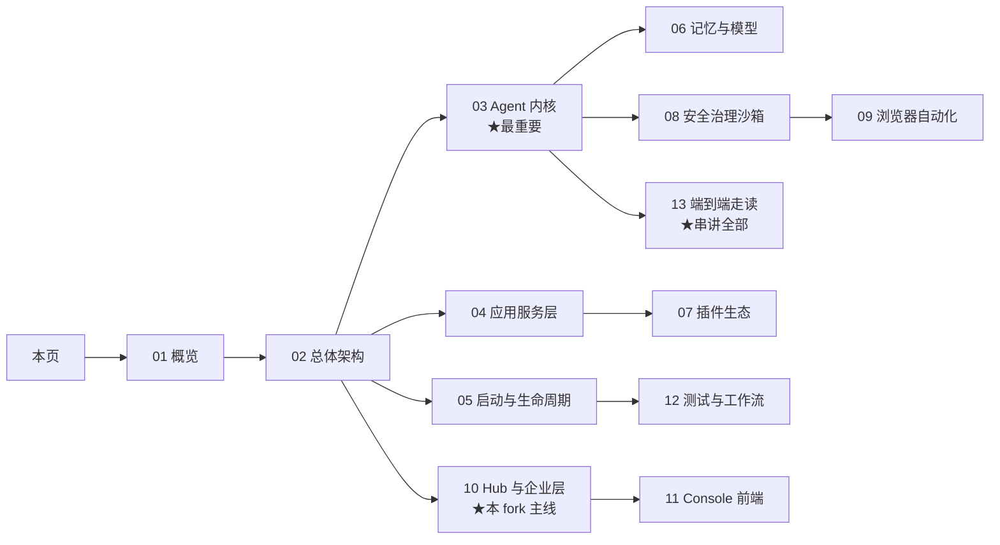

# QwenPaw DeepWiki · 深度学习文档

> 面向**想深入理解本仓库的工程师**的代码导航文档（DeepWiki 风格）：每页结论都附代码落点（`文件:行号`），可按图索骥。
> 基线：`feature/enterprise` @ 357c11b7（上游 v2.2.1 后 + 企业线 EP-2-15）。生成日期：2026-09-15。

## 项目一页纸

**QwenPaw** = 可自托管的个人 AI 助手（AgentScope 2.0 出品，Apache 2.0）：一个会用工具、有记忆、能被治理的 Agent，经 Console/TUI/桌面/18 聊天渠道与人交互，靠 Skills/Plugins/MCP 无限扩展。本仓库是其**企业内 fork**，在 `feature/enterprise` 分支维护企业增强层（ACL 权限、模型统一治理、K8s、用量可观测、平台治理贯通）。

| 快速事实 | 值 |
|---|---|
| 后端 | Python 3.11-3.13 · FastAPI · AgentScope 2.0（`src/qwenpaw/` ≈ 23 万行） |
| 前端 | React 18 + TS + Vite（`console/` ≈ 20 万行）+ Tauri 桌面壳 |
| 核心抽象 | Workspace（每 Agent 一个）→ Runtime（8 阶段请求编排）→ QwenPawAgent（ReAct + Scroll Context + Stop Gates） |
| 招牌特性 | Loop Engineering（8 种声明式 stop gate）· 三层记忆（Scroll+ReMe）· OS 级沙箱三平台 · 35 模型厂商 |
| 企业线 | Phase 0/1 ✅ · Phase 2 平台线 P0 ✅（EP-2-11..14）+ EP-2-15 human_gate |

## 阅读地图

## 页面索引

| 页 | 标题 | 一句话 | 适合谁 |
|---|---|---|---|
| [01](01-overview.md) | 项目概览 | 是什么/技术栈/仓库地图/运行形态 | 所有人，先读 |
| [02](02-architecture.md) | 总体架构 | 分层图·消息全链路时序·8 阶段·6 个设计决策 | 所有人 |
| [03](03-agent-core.md) | Agent 内核 ★ | QwenPawAgent·ReAct 迭代内部·Loop Gates·Scroll·模式·子代理·harness/ACP | 想改 Agent 行为的人 |
| [04](04-app-server.md) | 应用服务层 | FastAPI 组装·SSE 消息生命周期·18 渠道·审批·cron·mail | 后端 |
| [05](05-runtime-lifecycle.md) | 启动与生命周期 | CLI 树·启动链 14 步·工作区布局·持久化三层·hooks | 后端/运维 |
| [06](06-memory-providers.md) | 记忆与模型接入 | 三层记忆真相·ReMe 集成·35 厂商抽象·本地 llama.cpp·模型路由 | 想理解记忆/换模型的人 |
| [07](07-plugin-ecosystem.md) | 插件与生态 | PluginApi 13 注册点·官方插件形态·技能市场·迁移·PawApp | 想写插件的人 |
| [08](08-security-governance.md) | 安全治理沙箱 | 治理 4 Phase 评估·21 条危险命令规则·沙箱三平台·Driver 门禁 | 安全/平台 |
| [09](09-browser-automation.md) | 浏览器与桌面自动化 | 三控制链路·副作用三分类门禁·computer_use·tunnel·Tauri | 自动化 |
| [10](10-hub-enterprise.md) | Hub 与企业层 ★ | Hub 控制面·ACL 唯一强制点·模型目录·K8s·EP-2-11..15 全解 | 本 fork 的所有人 |
| [11](11-console-frontend.md) | Console 前端 | 技术栈·25+ 路由·SSE 消费·菜单权限管线·website | 前端 |
| [12](12-testing-workflow.md) | 测试与工作流 | 577 unit/24 contract/194 integration·CI 门禁·pre-commit·贡献纪律 | 所有贡献者 |
| [13](13-flows.md) | 端到端走读 ★ | 4 条链路逐步走代码：对话/危险命令/技能安装/企业租户 | 读完想串起来的人 |

## 三条学习路径

- **产品上手线**（半天）：README Quick Start → Console 各页 → 对照 [01](01-overview.md) 仓库地图认目录 → [13](13-flows.md) 附录的 5 个动手实验。
- **内核线**（2-3 天）：[02](02-architecture.md) → [03](03-agent-core.md) → [06](06-memory-providers.md) → [08](08-security-governance.md) → [13](13-flows.md) 流程 A/B。
- **企业线**（1-2 天）：[10](10-hub-enterprise.md) → `docs/enterprise/01-master-plan.md` → `10-task-plan.md` WBS → [12](12-testing-workflow.md) 的 fork 纪律。

## 权威文档对照（本 wiki 不替代它们）

| 主题 | 权威来源 |
|---|---|
| 官方用户文档 | https://qwenpaw.agentscope.io/（源码在 `website/public/docs/`） |
| 企业层设计决策 | `docs/enterprise/01-11`（本 wiki [10](10-hub-enterprise.md) 是其代码视角导读） |
| 贡献指南 | `CONTRIBUTING.md` / `CONTRIBUTING_zh.md` |
| 环境管理定论 | `docs/design/environment-management-redesign.md` |
| fork 维护纪律 | `ENTERPRISE.md` + `docs/enterprise/09-upstream-strategy.md` |

> ⚠️ 行号会随提交漂移：本 wiki 的 `文件:行号` 以 357c11b7 为准，漂移时按符号名（类/函数）搜索定位。
